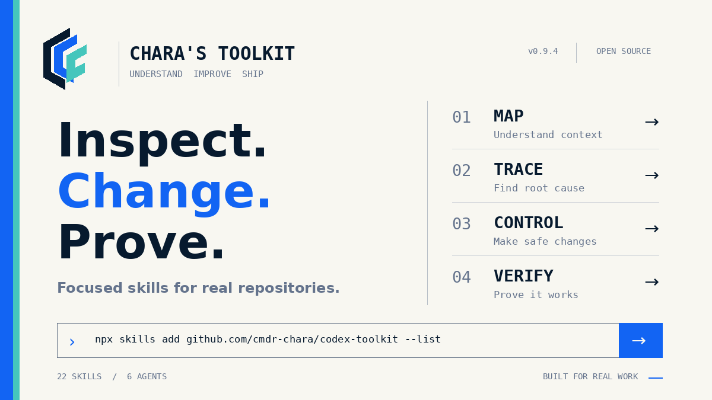

# Chara's Toolkit

**Better engineering, any agent.**

22 engineering skills for coding agents, plus a complete Codex workflow.

[Guida in italiano](docs/guida-italiano.md)

[](https://github.com/cmdr-chara/chara-toolkit/actions/workflows/ci.yml)
[](LICENSE)

<p align="center">
  
</p>

Chara's Toolkit gives coding agents focused instructions for understanding repositories, finding bugs, changing code safely, and proving that a change works. Each skill is a self-contained `SKILL.md` folder. The Codex setup adds routing, six optional Mission Control roles, and release-based updates.

## Choose your setup

### Codex (fully integrated)

Requires **Node.js 18+** and a configured **Codex** installation.

```sh
npx --yes github:cmdr-chara/chara-toolkit setup
```

This installs:

- all 22 skills;
- six optional Mission Control roles;
- workflow routing and the managed `AGENTS.md` instructions;
- a user-level updater that follows published GitHub releases.

Prefer a global command?

```sh
npm install --global github:cmdr-chara/chara-toolkit
chara setup
```

`codex-toolkit` remains a compatibility alias for `chara`.

### One skill only

Browse the catalog:

```sh
npx skills add https://github.com/cmdr-chara/chara-toolkit --list
```

Install one skill for Codex at user level:

```sh
npx skills add https://github.com/cmdr-chara/chara-toolkit \
  --skill repository-intelligence -g -a codex
```

This uses the portable `SKILL.md` format. It does not install Codex routing, Mission Control roles, or the toolkit updater. See the [portability guide](docs/portable-skills.md) for client-specific details.

## Start using it

After a full setup, inspect the installation:

```sh
npx --yes github:cmdr-chara/chara-toolkit mission-control check
```

Then start a **new Codex task** and describe the result you want. The router chooses the smallest relevant specialist; you usually do not need to name a skill.

```text
Find important bugs in this repository, fix them, and verify the changes.
```

```text
This API is slow. Measure the bottleneck, improve it, and compare the results.
```

```text
Review this authentication change and report only security issues that can be verified from the code.
```

Your project's `AGENTS.md` remains higher priority than general toolkit guidance. Skills guide the agent; your host still controls files, tools, network access, and approvals.

## Skill catalog

| Skill | Use it for |
| --- | --- |
| `repository-intelligence` | Map architecture, ownership, dependencies, hotspots, and change impact. |
| `bug-finder` | Hunt for previously unknown correctness defects and prove or retire candidates. |
| `debugging-investigator` | Reproduce a concrete failure, trace its cause, and design a focused fix. |
| `review-and-refactor-code` | Review a defined area and make behavior-preserving refactors. |
| `security-review` | Trace trust boundaries and assess exploitable security flaws. |
| `optimize-codebase-performance` | Measure a named bottleneck and compare a bounded optimization. |
| `codebase-evolution-controller` | Plan dependency, API, schema, and framework transitions with rollback paths. |
| `codebase-improvement-planner` | Discover and rank evidence-backed repository improvements. |
| `documentation-synchronizer` | Keep user, developer, API, migration, and operations docs aligned with code. |
| `verification-and-release` | Decide what must be verified and whether an integrated change is ready to ship. |
| `unlazy` | Track completion gates and prevent missing deliverables on substantial work. |
| `toolchain-preflight` | Resolve local shell, runtime, package-manager, and browser blockers. |
| `typescript-quality-enforcer` | Improve TypeScript and JavaScript type safety and lint discipline. |
| `production-web-builder` | Build or audit production web interfaces. |
| `screenshot-to-interface` | Reconstruct maintainable interfaces from visual references. |
| `product-design-director` | Define UX, visual direction, accessibility, and responsive behavior. |
| `mobile-architecture-director` | Choose a mobile architecture from evidence and constraints. |
| `flutter-production-builder` | Build or audit production Flutter applications. |
| `expo-react-native-builder` | Build or audit production Expo and React Native applications. |
| `delegate-with-mission-cards` | Split independent work into bounded missions with explicit ownership. |
| `multi-agent-work-coordinator` | Coordinate safe parallel work across non-overlapping resources. |
| `content-provenance-hygiene` | Inspect and sanitize authorized metadata and provenance surfaces. |

The machine-readable catalog is in [`skills/llms.txt`](skills/llms.txt). The six optional roles are `architect-writer`, `builder-writer`, `investigator-reader`, `patcher-writer`, `pathfinder-reader`, and `sentinel-reader`.

## What works where

| Capability | Full Codex setup | Compatible Agent Skills client |
| --- | --- | --- |
| Individual `SKILL.md` folders | Yes | Yes, when the client supports the format |
| Natural-language routing across the toolkit | Yes | No, install and select skills through the client |
| Mission Control roles and workflow orchestration | Yes | No, Codex-specific |
| Toolkit updater and managed `AGENTS.md` block | Yes | No, Codex-specific |

The skill folders provide instructions, references, and scripts. They do not grant runtime permissions, API keys, or network access.

## Options and updates

Preview a setup without changing files:

```sh
npx --yes github:cmdr-chara/chara-toolkit setup --dry-run
```

Install without registering a scheduled updater:

```sh
npx --yes github:cmdr-chara/chara-toolkit setup --no-auto-update
```

With a global install, manage the updater with:

```sh
chara auto-update status
chara auto-update remove
chara auto-update install
```

Use `--codex-home /path/to/codex` when Codex uses a non-default home. The setup preserves instructions outside its managed `AGENTS.md` block and backs up managed files before replacement.

## Documentation

- [Guida in italiano: installazione e uso](docs/guida-italiano.md)
- [Portability guide](docs/portable-skills.md) · [Skill catalog](skills/llms.txt)
- [Workflow routing](orchestration/workflows.md) · [Responsibility matrix](docs/responsibility-matrix.md)
- [Automatic updates](docs/auto-update.md) · [Enterprise deployment](docs/enterprise-deployment.md)
- [Application verification](docs/project-verification.md) · [Destructive-operation safety](docs/destructive-operations-safety.md)
- [Evaluations](evaluations/README.md) · [Contributing](CONTRIBUTING.md) · [Changelog](CHANGELOG.md)
- [Security reporting](SECURITY.md) · [Third-party notices](THIRD_PARTY_NOTICES.md)

## License

[MIT](LICENSE) © 2026 cmdr-chara. Third-party sources, modifications, and preserved license notices are listed in [THIRD_PARTY_NOTICES.md](THIRD_PARTY_NOTICES.md).
